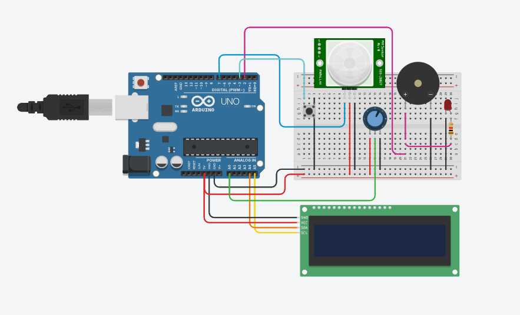

# Smart Security System (Alarm Pendeteksi Gerakan)

## Identitas Anggota
| Nama                          | NIM        |
|------------------------------|------------|
| Eka Bintang Wicaksono        | H1D023054  |
| Dhimas Wildan Nur Zakariya   | H1D023050  |
| Putranto Surya Wijanarko     | H1D023048  |
| Muhammad Syahrial Hipdi      | H1D023047  |
| Raditya Yusuf Ramadhan       | H1D023057  |

## Deskripsi Projek
Sistem ini merupakan alarm keamanan berbasis Arduino yang menggunakan PIR sensor untuk mendeteksi gerakan. Ketika gerakan terdeteksi, sistem akan mengaktifkan buzzer sebagai alarm, menyalakan LED sebagai indikator visual, serta menampilkan pesan peringatan pada LCD melalui komunikasi I2C. Data status juga dikirim melalui komunikasi serial untuk monitoring.

## Komponen
- Arduino UNO R3
- Breadboard
- Jumper
- PIR Sensor
- Buzzer (Piezo)
- LED
- LCD 16x2 I2C PCF8574-based, 39 (0x27)
- Resistor 1k Ω

## Cara Kerja
Sistem akan mendeteksi gerakan menggunakan PIR sensor.
Jika ada gerakan:
- Alarm (buzzer) berbunyi
- LED menyala
- LCD menampilkan peringatan
- Status dikirim ke Serial Monitor

## Rangkaian

